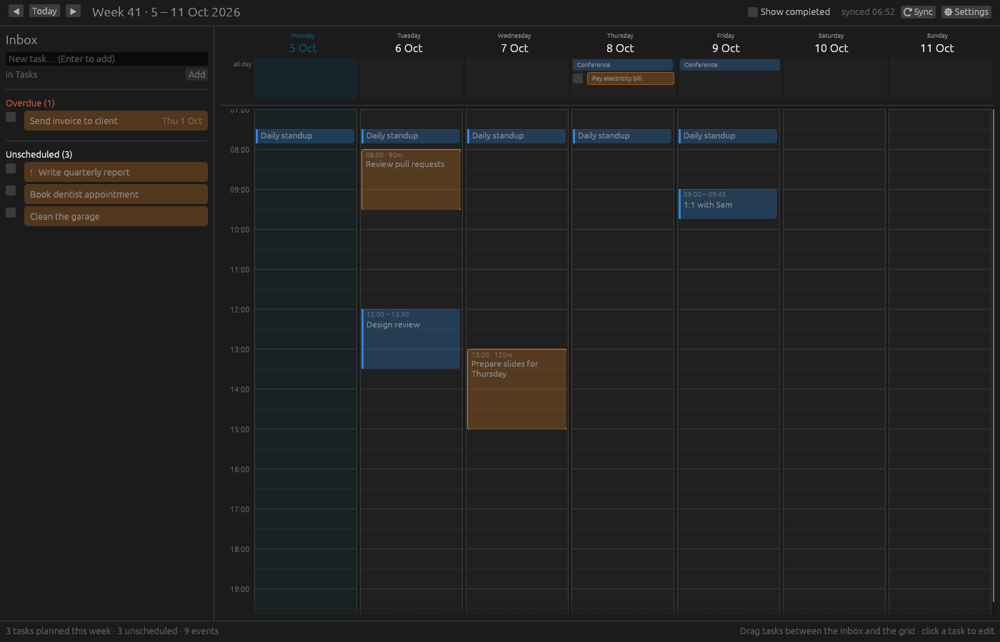

# Week Planner

A desktop week planner for people who keep their to-dos in CalDAV. It shows
your calendar events next to your tasks so you can drag the week into shape,
and every change is written straight back to the server.



The interface follows the [GNOME Human Interface Guidelines](https://developer.gnome.org/hig/):
a header bar with navigation on the left and the primary menu on the right,
a sidebar of boxed lists, dialogs with their actions in the header bar,
preference groups with switches, toasts for errors, the Adwaita palette in
light and dark, and the Inter typeface that Adwaita Sans is based on. The
theme follows the system; set `PLANNER_THEME=light` or `dark` to force one.

- **Week grid** – seven days with an all-day row and hourly slots. Calendar
  events (VEVENT) are drawn read-only so you can plan around them.
- **Inbox** – every task (VTODO) without a date, plus anything overdue. Type a
  task and press Enter to capture it while you look at the week.
- **Drag and drop** – drag a task from the inbox onto a day (all-day) or onto a
  time slot (snaps to 15 minutes). Drag it back to the inbox to unschedule.
- **Edit** – click any task to change its summary, notes, date, time, length,
  priority or completion. Tick the checkbox to complete it.
- **Sync** – tasks and events come from any CalDAV server (Nextcloud, Radicale,
  Baïkal, iCloud, Fastmail, …) and tasks are written back with etag checks, so
  an edit made elsewhere is never overwritten silently. The week refreshes
  every five minutes and whenever you navigate.

Built in Rust with [egui/eframe](https://github.com/emilk/egui).

| Shortcut | Action |
| --- | --- |
| Ctrl+N | New task |
| Alt+← / Alt+→ | Previous / next week |
| Ctrl+T | Go to today |
| Ctrl+R | Refresh from server |
| Ctrl+, | Preferences |
| Ctrl+? | Keyboard shortcuts |
| Ctrl+Enter / Esc | Save / close a dialog |

## Build and run

```sh
cargo run --release
```

On Linux you need the usual GUI libraries (X11 or Wayland, OpenGL,
`libxkbcommon`). No cmake or system TLS library is required.

### NixOS / Nix

The repository ships a flake. winit loads the Wayland, X11 and OpenGL
libraries with `dlopen` at runtime, so on NixOS a plain `cargo run` fails
with `WaylandError(Connection(NoWaylandLib))`. The dev shell puts those
libraries on `LD_LIBRARY_PATH` and provides the Rust toolchain:

```sh
nix develop        # then: cargo run --release
nix run            # build and run the packaged binary
nix build          # result/bin/planner
```

With [direnv](https://direnv.net/), `echo 'use flake' > .envrc && direnv allow`
enters the shell automatically.

On first start the Preferences dialog asks for your server URL, username and
password. Any of these work as the URL: the bare host, the `/.well-known/caldav`
path, your principal URL or the calendar home; the app discovers the rest. Use
an app-specific password where your provider offers one.

## Configuration

Settings are stored in `planner/config.toml` under your OS config directory
(`~/.config` on Linux, `~/Library/Application Support` on macOS,
`%APPDATA%` on Windows). Set `PLANNER_CONFIG=/path/to/config.toml` to use a
different file.

```toml
server_url = "https://cloud.example.com/remote.php/dav"
username = "me"
password = "app-password"
default_task_calendar = ""   # calendar URL for new tasks; empty = first task calendar
task_calendars = []          # calendar URLs to load tasks from; empty = all
event_calendars = []         # calendar URLs to load events from; empty = all
day_start_hour = 7
day_end_hour = 21
default_task_minutes = 60
show_completed = false
```

The Preferences dialog edits all of this, including which calendars are used
once they have been discovered.

## How tasks are stored

- A task dropped on a day gets `DUE;VALUE=DATE`.
- A task dropped on a time slot gets `DTSTART` and `DUE` (slot start and end),
  so clients that show either property agree.
- Unscheduling removes both. Completing sets `STATUS:COMPLETED`,
  `PERCENT-COMPLETE:100` and `COMPLETED`.
- All other properties of the VTODO are preserved byte for byte.

## Development

```sh
cargo test                          # unit tests (iCalendar, CalDAV XML, model)
cargo clippy
```

### Testing against a real CalDAV server

`tests/stalwart.rs` spawns a throwaway [Stalwart Mail Server](https://stalw.art)
on a free port, provisions it through its JMAP API (bootstrap, one HTTP
listener, a user account) and drives the app's CalDAV client against it:
discovery from a bare URL, task create/update/delete with etag checks, day and
time-slot scheduling, preservation of foreign properties, and event fetching
with server-side recurrence expansion. Fetch the server binary once:

```sh
scripts/fetch-stalwart.sh      # downloads v0.16.25 into target/stalwart/
cargo test --test stalwart
```

The test looks for the binary in `STALWART_BIN`, then `target/stalwart/stalwart`,
then `PATH`. If none is found it prints a notice and passes; set
`PLANNER_REQUIRE_STALWART=1` (as CI does) to make that a failure instead. The
server runs with its own temporary data directory and is killed when the test
ends; its log is printed if an assertion fails. Provisioning takes a few
seconds, so all scenarios share one server inside a single test.

The same client can also be pointed at any other server with the ignored
round-trip test, for example a local [Radicale](https://radicale.org):

```sh
PLANNER_TEST_SERVER=http://127.0.0.1:5232/ PLANNER_TEST_USER=demo \
PLANNER_TEST_PASSWORD=x cargo test -- --ignored
```

`.github/workflows/ci.yml` runs formatting, clippy and all tests, including
the Stalwart suite, on every push and pull request.

For UI work in a headless environment, the `screenshot` feature saves a PNG
after a delay and exits:

```sh
cargo build --features screenshot
PLANNER_SCREENSHOT=out.png PLANNER_SCREENSHOT_AFTER_MS=3000 \
  PLANNER_THEME=dark PLANNER_SCREENSHOT_DIALOG=preferences \
  xvfb-run -a target/debug/planner
```

`PLANNER_SCREENSHOT_DIALOG` may be `editor`, `preferences`, `about` or
`shortcuts`.

### Layout

| Path | Purpose |
| --- | --- |
| `src/lib.rs` | Library root; `src/main.rs` is a thin binary around it |
| `src/ical.rs` | Round-trip-safe iCalendar parser and writer |
| `src/model.rs` | `Task`, `Event`, `Calendar` and their mapping to VTODO/VEVENT |
| `src/caldav.rs` | HTTP client: discovery, `calendar-query` reports, PUT/DELETE |
| `src/sync.rs` | Background thread so the UI never blocks on the network |
| `src/app.rs` | Application state, actions and top-level layout |
| `src/ui/theme.rs` | Adwaita palette, fonts, icons, switches, boxed lists |
| `src/ui/dialogs.rs` | Modal dialog scaffold, About and Keyboard Shortcuts |
| `src/ui/` | Inbox sidebar, week grid, task editor, preferences |
| `assets/fonts/` | Inter Regular and SemiBold (SIL Open Font License) |
| `tests/common/mod.rs` | Spawns and provisions a Stalwart server for tests |
| `tests/stalwart.rs` | End-to-end CalDAV scenarios against that server |
| `scripts/fetch-stalwart.sh` | Downloads the pinned Stalwart release |
